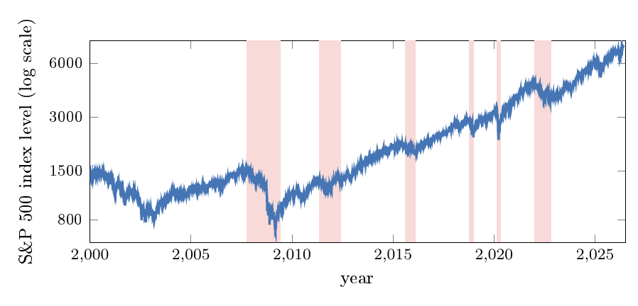
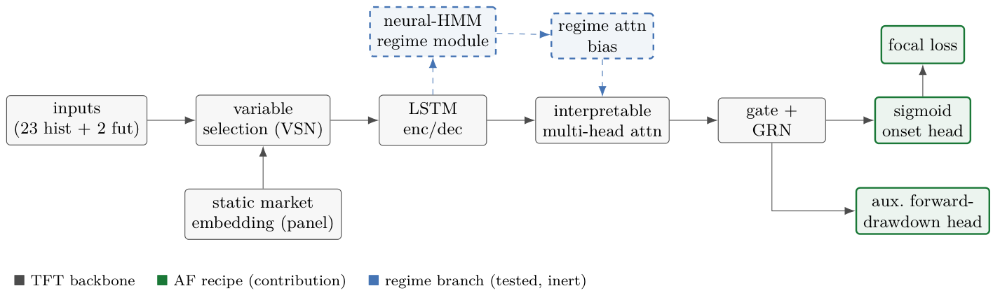
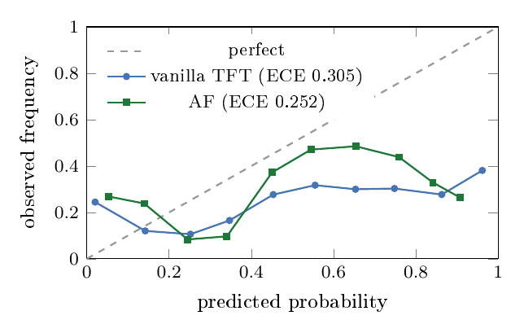
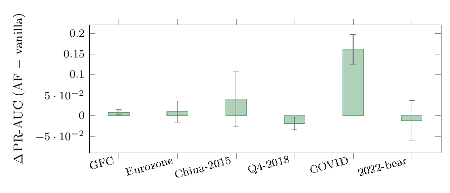

# Equity Crisis Early Warning with Temporal Fusion Transformers

[](https://github.com/sarpvulas/crisis-ews-tft/actions/workflows/ci.yml)
[](LICENSE)

> **My MSc Computational Finance dissertation, King's College London (2026)**
> Hüseyin Sarp Vulaş · Supervisor: Dr Bart de Keijzer

**Read the dissertation: [`docs/dissertation.pdf`](docs/dissertation.pdf)**

## TL;DR

Stock-market crashes are rare, so models that try to warn of them have very few examples to learn from. I built a leak-free test of whether a Temporal Fusion Transformer can warn of an S&P 500 drawdown crisis starting within the next 63 trading days, and checked whether regime awareness (a hidden-Markov regime module with regime-conditioned attention) helps. Regime awareness made no measurable difference; what helped was adding an auxiliary head that predicts the forward drawdown every day, which gave a model better calibrated than the vanilla TFT (lower Brier score in all six crisis folds). Its macro PR-AUC of 0.487 beats the 0.357 of the best tuned tree model (that tree configuration was chosen on the test folds, so the comparison favours the tree), while its gain over the vanilla TFT (0.487 vs 0.459) is not statistically significant; the head ablation's +0.034 macro PR-AUC is (p = 0.031, CI [+0.013, +0.060]).

## Why this matters

Crisis early-warning models are easy to flatter: with only a handful of crises per market, look-ahead leakage, untuned baselines and one lucky run can all make a fashionable architecture look better than it is. This project uses walk-forward folds with a 63-day embargo, episode-level significance tests, calibration analysis and tuned baselines, so that a real improvement (the auxiliary drawdown head) can be told apart from an unsupported one (regime awareness).



*S&P 500 (log scale), 2000-2026, with the six crisis episodes used as walk-forward test folds shaded.*

## Detailed findings

This is my dissertation project: a leak-free study of deep learning for **equity-crisis early warning (EWS)**. Given the market state up to today, I predict whether a drawdown crisis will *begin* within the next quarter (a 63-trading-day horizon). I take the **Temporal Fusion Transformer (TFT)** as my backbone and ask two questions:

1. Does **regime awareness** (a neural hidden-Markov regime module + regime-conditioned attention) improve crisis prediction?
2. If not, what does?

**What I found (under a deliberately leak-free protocol):**

- **Regime awareness is inert** — my fully regime-aware TFT is statistically indistinguishable from a vanilla TFT, and this holds across both the single-market and panel settings.
- **What actually helps is a change to the *learning problem*, not the architecture:** I add a multi-task **auxiliary forward-drawdown head** that supervises the model on a signal defined *every* trading day, instead of only on the handful of sparse onset labels (my **"AF" recipe**). It is **better calibrated than the vanilla TFT** (lower Brier in **all six** crisis folds; ECE 0.287 vs 0.319) and improves discrimination, concentrated in severe crises.
- **A three-way head ablation isolates the credit, and it lands on the auxiliary head alone.** Holding the objective fixed, adding the drawdown head gains `+0.034` macro PR-AUC and wins in **all six** crisis folds — episode-level Wilcoxon `p = 0.031` with a block-bootstrap CI of `[+0.013, +0.060]` that excludes zero, a stronger statement than the AF-vs-vanilla headline whose interval spans zero. The **focal loss is inert**: classification-only with focal sits `0.005` *below* the plain-BCE baseline (`p = 1.000`), so reading the recipe as "aux **and** focal" credits an ingredient that does no work. And the classification head **cannot** simply be swapped out — regression-only reaches `0.365` against a `0.336` prevalence baseline, below every configuration that keeps a classifier.
- My deep models **beat *tuned* trees on the single-market task** (AF 0.487 vs best tuned tree 0.357 macro PR-AUC), and my capacity-matched recipe (**AFv2**) is **competitive with / marginally ahead of XGBoost on a 9-market panel** (0.385 vs 0.373 PR-AUC), which I confirm under a panel walk-forward.
- My contribution is **methodological as much as architectural**: a reproducible, leak-free evaluation (embargoing, episode-level significance, calibration + usefulness analysis, tuned baselines) that separates a real, transferable improvement from a fashionable but unsupported one.

**Full write-up:** [`docs/dissertation.pdf`](docs/dissertation.pdf) · [`docs/dissertation.tex`](docs/dissertation.tex)

---

## The problem at a glance

Crisis episodes are rare, so a single market only gives me a handful per decade. I label a **crisis onset** as the first day of a sustained drawdown of ≥10% from the trailing 252-day peak ("dd10"), and predict its onset over the next 63 trading days. I turn six S&P 500 crisis episodes (2000–2026) into crisis-anchored **walk-forward** test folds, each with an expanding training history and a 63-day **embargo** to prevent look-ahead leakage.

---

## My model

The backbone is the TFT (Lim et al., 2021). My contribution (**green**) adds a multi-task auxiliary head that predicts the forward drawdown trajectory — a dense signal available every day, unlike the sparse onset label. The AF configuration also carries a focal loss on the rare crisis cases, though my head ablation shows that term earns nothing (see below). The regime branch (**blue, dashed**) is what I implemented and ablated but found inert.



My training objective combines focal classification, the auxiliary drawdown MSE, and (for the rejected regime variant) a regime NLL term:

```
L = β · L_focal(p, y) + λ · MSE(d̂, d) + γ_reg · L_regime
```

Setting `β = 0` leaves the regression head training alone; setting `λ = 0` leaves the classifier alone. Those two settings are exactly the ablation cells in *Which head does the work?* below.

---

## My results

**Single-market (six folds, ~30 seeds, dd10):**

| Model | macro PR-AUC | Brier ↓ |
|---|:---:|:---:|
| **AF (aux head + focal)** | **0.487** | **0.270** |
| Vanilla TFT | 0.459 | 0.317 |
| Full RA-TFT (regime) | 0.463 | 0.304 |
| Random Forest (tuned) | 0.357 | 0.304 |
| XGBoost (tuned) | 0.340 | 0.387 |
| HistGradientBoosting (tuned) | 0.333 | 0.376 |
| LSTM | 0.347 | 0.430 |

*Each tree row is the best of a grid scored on the test fold itself — an optimistic upper bound, adopted because four of the six validation splits have no positive labels. Even so, the best tree (0.357) stays ~0.13 below my deep models.*

**Calibration** — the most consistent benefit of my AF recipe (lower ECE *and* lower Brier in all six folds):



**Where my discrimination gain comes from** — concentrated in severe, volatile regime-shift crises; I report the episode-level uncertainty honestly (the bootstrap CI spans zero):



**Which head does the work?** The AF cell changes two things at once against vanilla — it adds the drawdown head *and* swaps weighted BCE for focal loss — so AF-vs-vanilla cannot say which one matters. A three-way ablation with the regime branch off throughout, and the identical focal objective in every cell that has a classification term, settles it (six folds, 30 seeds, prevalence 0.336):

| Configuration | macro PR-AUC | Brier ↓ | skill |
|---|:---:|:---:|:---:|
| M0 (vanilla TFT, weighted BCE) | 0.459 | 0.317 | 0.156 |
| CLF-only (focal, no aux head) | 0.452 | 0.285 | 0.145 |
| **Both heads (AF)** | **0.485** | 0.279 | **0.191** |
| REG-only (drawdown head alone) | 0.365 | **0.249** | 0.037 |

- **The auxiliary head carries the recipe.** With the loss held fixed, adding it is worth `+0.034` macro PR-AUC and it wins in **all six** folds — episode-level Wilcoxon `p = 0.031` (6/6 is the smallest two-sided *p* six episodes can return), bootstrap CI `[+0.013, +0.060]`.
- **The focal loss is inert.** CLF-only differs from M0 only in the objective and lands `0.005` *below* it, winning three folds of six (`p = 1.000`). The loss change my exploratory sweep liked does not survive at six folds and thirty seeds.
- **The classifier can't be replaced by the regressor.** REG-only clears prevalence by almost nothing. Re-scoring the same models under the opposite sign gives `0.422`, and even an oracle allowed to pick the better sign per fold in hindsight reaches only ≈`0.47`.
- **Why two heads beat either alone:** REG-only wins exactly on the folds where the classifiers drop *below their own prevalence baseline* — GFC and Q4-2018 — because those training windows are label-starved (GFC has no positive labels at all), while the drawdown target is defined every day. Where crisis labels are plentiful the ordering flips hard (COVID `0.794` vs `0.522`). Dense supervision is a **complement** that supplies gradient where sparse targets fail, not a substitute for discrimination.

**Nine-market panel:** my AFv2 (capacity-matched recipe) reaches `0.385` PR-AUC / `0.594` ROC-AUC / `0.270` Brier vs XGBoost `0.373` / `0.585` / `0.273`; a five-fold panel walk-forward preserves the ordering. Full tables and significance are in my dissertation.

---

## Contents of this archive

`AUTHORSHIP.txt` carries my signed statement of sole authorship. Third-party
libraries are **not** included here — they are pinned in `requirements/` and
named in the report.

```
AUTHORSHIP.txt      my signed sole-authorship statement (please read first)
LICENSE             MIT for the source code; the Bloomberg-derived data is excluded

models/             the model code
  tft.py                    Temporal Fusion Transformer backbone (VSN, LSTM enc/dec, attention)
  ra_tft.py                 regime-aware variant: neural-HMM module + regime attention bias
  crisis_loss.py            focal loss, regime NLL, and the combined multi-task objective
  configs.py                model configuration dataclasses
  registry.py               name -> model factory ("tft", "ra-tft", "lstm", "xgboost", ...)
  baselines/                LSTM, XGBoost, Random Forest, HistGradientBoosting, logistic

training/           datasets (single-market + multi-market panel), trainer, evaluation loop
features/           causal feature engineering; topology.py (exploratory, not used in the report)

data/
  pipelines/                crisis labelling, feature engineering, walk-forward splits + embargo
  raw/                      not committed (git-ignored); the pipelines download FRED and Yahoo Finance series here
  mock/                     mock surrogate datasets for running the pipeline (see Data & licensing)
  labels/                   Laeven-Valencia crisis chronology (reference only)

scripts/
  run_experiment.py         the single entry point for every model and dataset
  reproduce.sh              one-command single-market reproduction (Docker)
  build_*_from_shared.py    build the processed task datasets from the Bloomberg pull
  make_figures.py           regenerate the .dat files behind every dissertation figure
  job_*.sh                  Slurm array jobs — one per experiment family (see below)

analysis/graphs/    exploratory plotting and interpretability (attention / VSN weights)
tests/              pytest suite for the pipeline, models and analysis code
sweep_configs/      hyperparameter sweep config (TDT task B)

docs/
  dissertation.tex / .pdf   the dissertation (build: cd docs && latexmk -pdf dissertation.tex)
  figures/                  pgfplots .dat files generated by scripts/make_figures.py
  img/                      rendered PNGs embedded in this README
  replication.md            step-by-step Docker reproduction walkthrough
  hpc-create.md             notes on running the Slurm jobs on KCL CREATE

Dockerfile.train , docker-compose.yml , docker-compose.gpu.yml
requirements/       pinned dependency sets (repro.txt = minimal CPU wheels)
```

**Which `job_*.sh` produced which result:** `job_conf_6fold.sh` — the six-fold
confirmatory (M0 / M4 / AF), the source of the headline table;
`job_head_ablation.sh` — the CLF-only / both-heads / REG-only ablation that
attributes the gain to the auxiliary head; `job_tree_tune.sh` — the tuned tree
grid; `job_panel*.sh` — the nine-market panel and its walk-forward;
`job_instr_eval.sh` — per-window predictions behind the reliability diagram;
`job_emb_ablations.sh` — the M0–M4 regime factorial.

---

## Running it with Docker

No Python setup or GPU is required for the CPU build (just Docker Desktop / Docker Engine with the `docker compose` v2 plugin).

The repo includes runnable **mock datasets** under `data/mock/` — no data download or Bloomberg access is required. They are synthetic surrogates of my processed feature datasets (the original Bloomberg-derived values are not redistributed — see *Data & licensing* below), so expect deviations from the exact dissertation numbers; the dissertation tables were produced on the real data.

**1. Build the image** (CPU; ~3 GB):

```bash
docker compose build train
```

**2. Smoke test — one model, one command.** `scripts/run_experiment.py` trains a model and writes a metrics JSON (PR-AUC, ROC-AUC, ECE, Brier) to `results/`:

```bash
# my AF recipe (the recommended model) on the single-market dataset
docker compose run --rm train \
  --model ra-tft --task B --seed 0 --epochs 40 \
  --use-aux 1 --lambda-aux 0.5 --loss focal --focal-gamma 2 --pos-weight 3.4 \
  --posthoc-calibrate platt \
  --data-dir data/mock/taskb_spx_bbg_onset_trough_rp252_dd10_emb63_6f \
  --results-dir results --checkpoint-dir checkpoints --device auto
```

**Without Docker** (CPU only; tested on Python 3.11): install PyTorch from the CPU wheel index and the pinned dependencies, then call the same script directly. A 1-epoch run of the AF command on the mock data took about 2 minutes (1 min 56 s) on a laptop CPU (the 40-epoch command above takes proportionally longer):

```bash
pip install "torch>=2.2,<3" --index-url https://download.pytorch.org/whl/cpu
pip install -r requirements/repro.txt
python scripts/run_experiment.py --model ra-tft --task B --seed 0 --epochs 1 \
  --use-aux 1 --lambda-aux 0.5 --loss focal --focal-gamma 2 --pos-weight 3.4 \
  --posthoc-calibrate platt \
  --data-dir data/mock/taskb_spx_bbg_onset_trough_rp252_dd10_emb63_6f \
  --results-dir results --checkpoint-dir checkpoints --device cpu
```

The test suite runs with `pip install -r requirements/data.txt "matplotlib>=3.8" pytest && python -m pytest -q`.

Drop the `--use-aux … --pos-weight 3.4` flags to get the **vanilla TFT** for comparison. Swap `--model` for `xgboost`, `plessis-rf`, `histgb`, `lstm`, or `logistic` to run the **tree/baseline** models.

The two single-head cells of the ablation, both with the regime branch off (`--use-regime-module 0 --use-regime-attention 0 --gamma 0`):

```bash
# CLF-only — same focal objective as AF, no auxiliary head
... --use-aux 0 --loss focal --focal-gamma 2 --pos-weight 3.4

# REG-only — --beta 0 drops the classification term entirely; the crisis score is
# read from the regression head through a 1-D logistic fitted on the TRAIN split,
# so the sign is learned rather than assumed
... --use-aux 1 --lambda-aux 0.5 --beta 0 --predict-from aux --dump-preds
```

**3. Reproduce my single-market headline** (AF vs vanilla TFT across all six crisis folds, seed 0) with one script:

```bash
bash scripts/reproduce.sh            # ~12 CPU trainings; prints a PR-AUC table
EPOCHS=10 bash scripts/reproduce.sh  # faster smoke version
```

It prints per-fold and macro test PR-AUC for vanilla vs AF. Seed 0 reproduces the *direction* of my result (AF ≥ vanilla, strongest on the severe COVID/China folds); my exact dissertation means average ~30 seeds on GPU (see below).

**4. Reproduce my panel result** (AFv2 vs the field, nine-market panel):

```bash
docker compose run --rm train \
  --model ra-tft --task B --seed 0 --epochs 60 \
  --state-size 128 --hidden-size 128 --lr 5e-4 \
  --use-aux 1 --lambda-aux 0.5 --loss focal --focal-gamma 2 --pos-weight 2.5 \
  --panel-path data/mock/panel_dd10_rp252/panel.parquet \
  --panel-train-end 2015-12-31 --panel-val-end 2018-12-31 \
  --panel-per-market-norm 1 --posthoc-calibrate platt \
  --results-dir results --checkpoint-dir checkpoints --device auto
```

**GPU** (optional, NVIDIA + container toolkit) — much faster:

```bash
docker compose -f docker-compose.yml -f docker-compose.gpu.yml build train
docker compose -f docker-compose.yml -f docker-compose.gpu.yml run --rm train <args> --device cuda
```

A step-by-step walkthrough is in [`docs/replication.md`](docs/replication.md).

---

## How I ran the full experiments (HPC)

I produced all my headline numbers with **Slurm array jobs** on the KCL CREATE cluster (NVIDIA A100). Each `scripts/job_*.sh` runs one experiment family (e.g. `job_conf_6fold.sh` = my six-fold confirmatory; `job_tree_tune.sh` = the tuned tree grid; `job_panel_wf.sh` = the panel walk-forward). I harden determinism (seeded loaders, `CUBLAS_WORKSPACE_CONFIG`, A100-pinned), aggregate to the dissertation tables, and regenerate figures with `python scripts/make_figures.py`.

Key flags on `run_experiment.py`:

| Flag | Purpose |
|---|---|
| `--use-aux --lambda-aux --loss focal --focal-gamma --pos-weight` | my AF recipe |
| `--beta 0` · `--predict-from {clf,aux}` | drop the classification term · score through the chosen head (the head ablation) |
| `--use-regime-module --use-regime-attention --num-regime-states` | the (inert) regime branch |
| `--panel-path --panel-train-end --panel-val-end --panel-test-end --panel-per-market-norm` | multi-market panel |
| `--posthoc-calibrate platt` · `--dump-preds` | calibration · per-window predictions (for reliability/usefulness) |
| `--n-estimators --max-depth --xgb-lr --min-samples-leaf` | tree-baseline hyperparameters |

---

## Data & licensing

**Licensing.** The MIT licence in [`LICENSE`](LICENSE) covers the source code only. The market data used by this project (daily Bloomberg series) is licensed separately and is not included or redistributed in this repository.

My underlying market series are **daily Bloomberg data (2000–2026)**, which I cannot redistribute under Bloomberg's licence terms. **No Bloomberg data is included in this repository.** So that the experiments can still be run end-to-end, the repo ships **mock datasets** — synthetic surrogates of the two processed datasets my headline results use:

- `data/mock/taskb_spx_bbg_onset_trough_rp252_dd10_emb63_6f/` — single-market S&P 500 task, six crisis folds (≈8 MB)
- `data/mock/panel_dd10_rp252/panel.parquet` — nine-market panel (≈11 MB)

**What the mock data is** (generated by [`scripts/make_replication_dataset.py`](scripts/make_replication_dataset.py), fully seeded and deterministic): a surrogate produced from my licensed pull by heavy stochastic perturbation — every continuous feature column carries additive autocorrelated AR(1) noise (ρ = 0.9) with an unconditional standard deviation of **20% of that column's full-sample std**. The features are perturbed with AR(1) noise at 20% of each column's standard deviation, while labels, dates and the forward-drawdown target are identical to the real task; the mock values therefore do **not** match any real market quote and must **never** be used as market data — they exist solely so that my pipeline, models, and evaluation protocol can be executed and inspected without a Bloomberg licence.

Structural properties, so replication stays meaningful:

- The noise draw is keyed on *(market, date, column)*: a given trading day is perturbed **identically** across `task_b_features`, every fold's train/val/test file, and the panel — no artificial train/test inconsistency is introduced.
- **Labels** (`ews_label`, `in_crisis`, `regime_label`), the **forward-drawdown regression target**, dates, and the split/embargo structure are identical to the real task; the crisis chronology itself (dot-com, GFC, eurozone, China 2015, Q4 2018, COVID, 2022 bear) is public knowledge.

Metrics obtained on the mock data will deviate from the dissertation tables, which were produced on the real data — the point of the mock set is to demonstrate the **protocol and the direction of the comparisons**, not to reproduce the exact numbers.

Raw FRED and Yahoo Finance downloads are **not committed**. The pipelines in `data/pipelines/` fetch them into `data/raw/` (git-ignored).

I **exclude entirely**: the raw Bloomberg pull (`data/shared/expanded/*.xlsx`), the consolidated `wide.parquet`/`long.parquet`, all real processed variants, and everything else under `data/shared/`. My full pipeline (`data/pipelines/`) and build scripts (`scripts/build_*_from_shared.py`) regenerate every real dataset from a licensed Bloomberg source, and `scripts/make_replication_dataset.py` regenerates the mock sets from the real ones.

## Citation

If you use my work, please cite my dissertation (see also [`CITATION.cff`](CITATION.cff)):

> Vulaş, H. S. (2026). *Dense Drawdown Supervision for Equity Crisis Early Warning: A Multi-Task Temporal Fusion Transformer and an Honest Test of Regime Awareness.* MSc Dissertation, King's College London.
